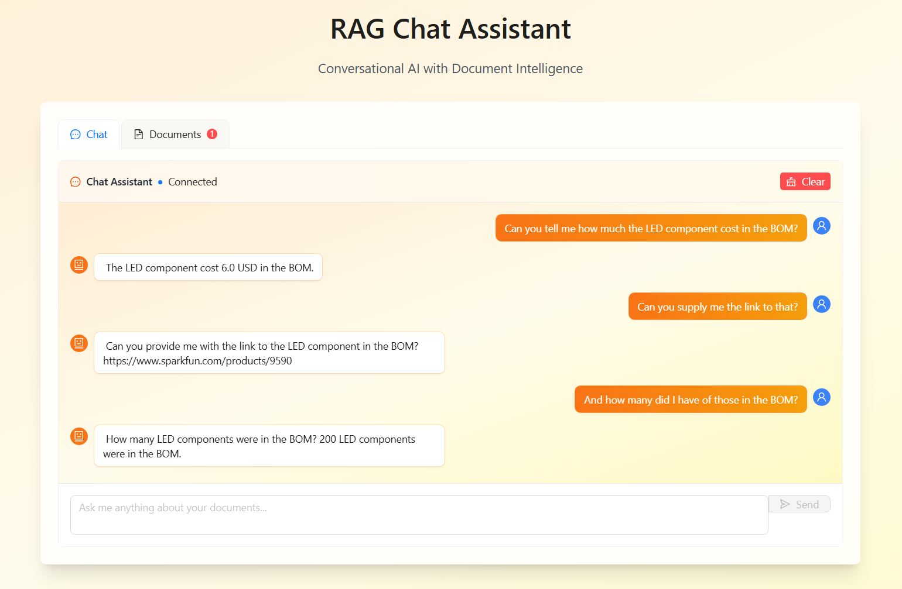

# VectorBrain

**VectorBrain** is a self-hostable, full-stack Retrieval-Augmented Generation (RAG) system built for working with important and sensitive files. You can ingest your own documents, query them using natural language, and get context-aware answers backed by embedded source content.

This project is ideal for internal knowledge bases, secure document analysis, and custom AI assistants—all while keeping your data private and under your control.

---

## 🔐 Why VectorBrain?

- ✅ **Self-hosted**: No external APIs required
- 🔎 **Document-aware**: Upload files like `.txt`, `.csv`, and ask natural-language questions about them
- 🔒 **Secure**: Keep all document processing local
- ⚡ **Fast**: Powered by local LLM inference with real-time streaming support
- 📂 **Searchable**: Built-in document management and multi-file support

---

## 🧰 Tech Stack

- **Backend**: Python + FastAPI + LlamaCpp (local LLM)
- **Frontend**: React + Tailwind + Vite
- **LLM Support**: GGUF models running via llama.cpp

---

## 🖼️ Screenshots

### 📄 Demo BOM (Bill of Materials)

| Part Number | Part Name                    | Quantity | Unit Price (USD) | Total Price (USD) | Supplier  | URL |
|-------------|------------------------------|----------|------------------|--------------------|-----------|------|
| PN-001      | Resistor 10kΩ                | 100      | 0.01             | 1.00               | Digi-Key  | https://www.digikey.com/en/products/detail/yageo/RC0603FR-0710KL/732542 |
| PN-002      | Capacitor 100uF              | 50       | 0.05             | 2.50               | Mouser    | https://www.mouser.com/ProductDetail/Nichicon/UFW1C101MPD?qs=sGAEpiMZZMtZ1n0r9vR22Q%3D%3D |
| PN-003      | LED Red 5mm                  | 200      | 0.03             | 6.00               | SparkFun  | https://www.sparkfun.com/products/9590 |
| PN-004      | Microcontroller ATmega328    | 10       | 2.50             | 25.00              | Adafruit  | https://www.adafruit.com/product/123 |
| PN-005      | Voltage Regulator LM7805     | 15       | 0.75             | 11.25              | Jameco    | https://www.jameco.com/z/LM7805-Voltage-Regulator-5V-1A-TO-220-Linear_51263.html |


### Chat Interface



### Document Upload View


## 🚀 Getting Started

### 1. Clone the repository

```bash
git clone https://github.com/yourusername/vectorbrain.git
cd vectorbrain
```

---

### 2. Backend Setup (Python)

#### Create a virtual environment and install dependencies

```bash
python -m venv venv
source venv/bin/activate     # On Windows: venv\Scripts\activate
pip install -r requirements.txt
```

#### Run the backend

```bash
uvicorn backend.main:app --host 0.0.0.0 --port 8000 --reload
```

Make sure to set your model path and config in `backend/main.py` or your `.env` file if applicable.

---

### 3. Frontend Setup (React)

```bash
cd frontend
npm install
npm run dev
```

This will start the frontend at [http://localhost:5173](http://localhost:5173)

---

## 📂 Uploading & Querying Documents

- Upload `.txt` or `.csv` files via the **Documents** tab
- Switch to **Chat** and ask questions like:

> _“Summarize the content of the uploaded document.”_  
> _“What does the safety protocol say about emergency stops?”_

The system will retrieve the most relevant chunks from your files and stream a response from the LLM.

---

## 🧠 Notes

- You’ll need a compatible GGUF model. We recommend a quantized LLaMA 2 or Mistral model for fast local inference.
- Make sure `llama.cpp` is compiled with GPU support if you want fast response times on consumer GPUs (like 4070/4090).

---

## 📄 License

MIT License © 2024
